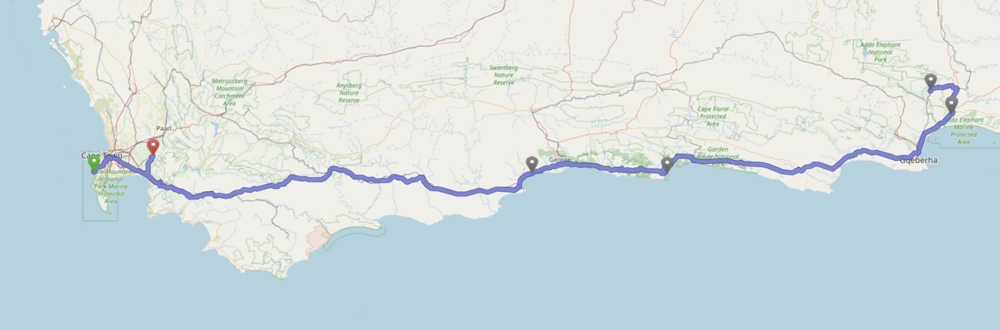

This is the fourth and final part of the photographic documentation of my 3-week trip through South Africa at the end of last year. My wife and I traveled over 1,700km (or about 1,000 miles) by car and my cameras took 4,366 photos. 865 of them made it to be shown after editing in Lightroom, 495 of them also made it to the public on this website. An acceptable average for a hobby photographer, I guess.

When we started planning the trip along the South African coast, Cape Town was already set as the start and end point, if only for logistical reasons. Choosing a national park for safaris (or game drives, as we later learned to say) wasn't that difficult either, as Addo is not far from the coast and is one of the top 10 South African national parks. We only needed to make a few stops so that we didn't have to drive 800km in one go. The choice fell on **Mossel Bay** on the outward route and **Plettenberg Bay** on the return route. We wanted to spend the last two days in tranquil **Stellenbosch**, not far from Cape Town, to wind down a little before heading back home for the winter.

<!-- more -->

---

## Hout Bay & Cape Town

Some people spend their entire vacation in the area around Cape Town and don't even come close to seeing everything worth visiting. For us, it was only a few, but very impressive days, as the photos in my third post of this mini-series prove:

\>\>\> [Hout Bay & Cape Town](/post/Hout-Bay-Cape-Town/)

---

## Mossel Bay

On the way east on the N2 towards Mossel Bay, we had to take a short break and decided to do so in [Dassiesfontain](https://g.co/kgs/cAk3a1R), an incredibly interesting general store and restaurant that offers everything (really everything) for the inhabitants of this very extensive agricultural region and now also seems to be very popular among tourists.

{% photo_masonry
  "24-12-Suedafrika-1150-D50"
  "24-12-Suedafrika-1157-D50"
  "24-12-Suedafrika-1159-D50"
  "24-12-Suedafrika-1161-D50"
  "24-12-Suedafrika-1162-D50"
  "24-12-Suedafrika-1166-D50"
  "24-12-Suedafrika-1167-D50"
  "24-12-Suedafrika-1168-D50"
  "24-12-Suedafrika-1169-D50"
  "24-12-Suedafrika-1171-PXL"
  "24-12-Suedafrika-1172-PXL"
  "24-12-Suedafrika-1182-D50"
  "24-12-Suedafrika-1191-D50"
  "24-12-Suedafrika-1197-D50-HDR"
  "24-12-Suedafrika-1215-D50-HDR"
  "24-12-Suedafrika-1229-D50"
  "24-12-Suedafrika-1230-D50"
  "24-12-Suedafrika-1255-D50"
  "24-12-Suedafrika-1256-D50"
  "24-12-Suedafrika-1270-D50"
  "24-12-Suedafrika-1277-D50"
  "24-12-Suedafrika-1287-D50"
  "24-12-Suedafrika-1289-D50"
  "24-12-Suedafrika-1290-D50"
  "24-12-Suedafrika-1300-D50"
  "24-12-Suedafrika-1312-D50"
  "24-12-Suedafrika-1314-D50"
  "24-12-Suedafrika-1322-D50-HDR"
  "PXL_20241224_075952090"
  "24-12-Suedafrika-1351-D50"
  "24-12-Suedafrika-1357-D50"
  "24-12-Suedafrika-1367-D50"
  "24-12-Suedafrika-1410-D50"
  "24-12-Suedafrika-1422-D50"
  "24-12-Suedafrika-1430-D50"
  "24-12-Suedafrika-1435-D50"
  "24-12-Suedafrika-1450-D50"
  "24-12-Suedafrika-1453-D50"
  "24-12-Suedafrika-1460-D50"
  "24-12-Suedafrika-1468-D50"
  "24-12-Suedafrika-1477-D50"
  "24-12-Suedafrika-1525-D50"
  "24-12-Suedafrika-1647-D50"
  "24-12-Suedafrika-1577-D50-HDR"
  "24-12-Suedafrika-1608-D50"
  "24-12-Suedafrika-1675-PXL"
  "24-12-Suedafrika-1595-D50"
%}

---

## Addo

I published the photos of the highlight of the four games drives in the reserves around Addo in my first two posts of this small series:

\>\>\>   [Addo Elephant National Park](/post/Addo-Elephant-National-Park/)
\>\>\>   [Schotia Safaris Private Game Reserve](/post/Schotia-Safaris-Private-Game-Reserve/)

---

## Plettenberg Bay

After our experiences in Addo, it was difficult for any other destination to surpass this. So, as planned, we only stayed one night in a hotel directly on the beach, although the whole area would have deserved much more attention.



---

## Stellenbosch

... is famous for its vineyards and the tranquil town, with a beautiful botanical garden, in the middle. Perfect for two days of relaxation with a picnic, shopping and (once again) very good food.

{% photo_masonry
  "24-12-Suedafrika-4231-PXL"
  "24-12-Suedafrika-4242-PXL"
  "24-12-Suedafrika-4248-PXL"
  "24-12-Suedafrika-4245-PXL"
  "24-12-Suedafrika-4253-PXL"
  "24-12-Suedafrika-4269-PXL"
  "24-12-Suedafrika-4276-PXL"
  "24-12-Suedafrika-4285-PXL"
  "24-12-Suedafrika-4286-PXL"
  "24-12-Suedafrika-4291-D50"
  "24-12-Suedafrika-4292-D50"
  "24-12-Suedafrika-4295-D50"
  "24-12-Suedafrika-4301-D50"
  "24-12-Suedafrika-4304-D50"
  "24-12-Suedafrika-4306-D50"
  "24-12-Suedafrika-4308-D50"
  "24-12-Suedafrika-4315-D50"
  "24-12-Suedafrika-4340-D50"
  "24-12-Suedafrika-4344-D50"
  "24-12-Suedafrika-4321-D50"
  "24-12-Suedafrika-4331-D50"
  "24-12-Suedafrika-4326-D50"
%}

---

## Conclusion

It was a damn load of fun to visit this extraordinary country, although I have to admit that I had some safety concerns before the trip, which all turned out to be unfounded as long as you didn't leave the tourist trails and didn't behave like an idiot.

Never before have I taken so many photos on a trip and had to edit them. It took me more than 2 months to do this, and a lot of other things were left undone, such as writing blog posts and the like. There are already notes piling up in my Obsidian Vault about things and ideas I want to write about. But now spring is coming here in Germany and the first flower beauties are already sprouting again in my neighbor Thomas' garden ... let's see what I'm going to do next ;)
