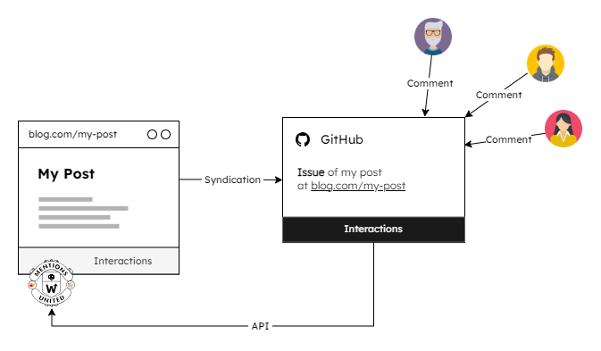

A few months ago, in my post [Using GitHub as Commenting Platform, 2025 Edition](/post/Using-GitHub-as-Commenting-Platform-2025-Edition), I explained how GitHub Issues can be used quite easily as a commenting platform:

1. Create a GitHub issue for each post that contains at least the post URL
2. Add a syndication link to the issue on the post page
3. Let Brid.gy and Webmention.io do their job
4. Integrate Mentions United into the page to display comments via the [Provider Plugin Webmentions](https://github.com/kristofzerbe/Mentions-United?tab=readme-ov-file#provider-webmentions)

So I've made it a habit to syndicate every new post in a GitHub issue. This saves me from having to set up my own spam-proof comment system, which is difficult or even impossible to implement on [SSG](https://en.wikipedia.org/wiki/Static_site_generator) sites anyway.

One might argue that the data chain **Site** &rarr; **GitHub** &rarr; **brid.gy** &rarr; **webmention.io** &rarr; **Site** is quite long and offers a lot of room for errors, but all I can say to that is: Yes, you're right, because that's exactly the case at the moment!

A blog like this, with two or three posts a month (if there's time), isn't exactly flooded with comments, so some time passed before I noticed that brid.gy is still polling my GitHub account, but unfortunately isn't getting any results and therefore isn't passing along any web mentions for GitHub issue comments. The chain has been broken!
I will certainly inform the creator [Ryan Barrett](https://snarfed.org/about) about this, but that doesn't help me at the moment, so I decided to build a [native GitHub provider plugin for Mentions United](https://github.com/kristofzerbe/Mentions-United?#provider-github).

<!-- more -->

---

## The GitHub Provider Plugin



The process wasn't really that complicated, because my code template for new Mention United providers already contains the basic structure, which I just had to fill up. It was also a little easier for me here because, unlike my native [Provider Plugin for Mastodon](/post/Mentions-United-Native-Mastodon-Provider/), I didn't need to evaluate any instances here, but could go directly to [https://api.github.com](https://api.github.com).

The first calls to the API endpoint relevant to my purposes, ``https://api.github.com/repos/{{OWNER}}/{{REPO}}/issues/{{ISSUENO}}/comments``, returned a lot of data, 80% of which I didn't need, but some of which was missing. GitHub only resolves the author of a comment via REST in a ``login`` object, which does not contain the user's name. To get that, I would have had to use another API endpoint. The [GitHub GraphQL API](https://docs.github.com/en/graphql) seemed to me to be a much more elegant, time-saving, and resource-efficient approach. It was the perfect opportunity to finally get to grips with [GraphQL](https://en.wikipedia.org/wiki/GraphQL).

Unlike a classic GET request to a REST URL with various URL parameters, GraphQL only has one URL to which you send a query specifically defined for this retrieval using POST in the request body. Here is my first attempt, which reads as follows:
Query the repository XXX of owner YYY for all issues with the number ZZZ and output the fields ``url`` and ``title`` and the first 100 comments in a nodes list with the fields ``id,`` ``login,`` ``body,`` ``url,`` and ``createdAt``:

```http
POST https://api.github.com/graphql
Authorization: Bearer {{TOKEN}}
Accept: application/vnd.github+json
X-REQUEST-TYPE: GraphQL

query {
  repository(owner: "YYY", name: "XXX") {
    issue(number: ZZZ) {
      url
      title
      comments(first: 100) {
        nodes {
          id
          author {
            login
          }
          body
          url
          createdAt
        }
      }
    }
  }
}
```

The trick to outputting additional author information is to first include the type of the ``author`` field using ``__typename``, because the interface can be either a ``User``, a ``Bot``, or an ``Organization``, and then explicitly define it as a user in order to output additional fields of exactly this type:

```http
  author {
    __typename
    ... on User {
      login      
      name
      avatarUrl
      websiteUrl
    }
  }
```

Once you understand the construct, calling up a GraphQL query like this is quite simple. Here is an excerpt from the finished plugin, which is [freely available on GitHub](https://github.com/kristofzerbe/Mentions-United/blob/main/mentions-united-provider_github.js):

```js
issueCommentQuery() { return { 
  query: `{
    repository(owner: "${this.owner}", name: "${this.repo}") {
      issue(number: ${this.issueNo}) {
        url
        title
        comments(first: 100) {
          nodes { 
            ... more fields 
          }
        }
      }
    }
  }`}; 
}

let fetchOptions = {
  method: 'POST',
  headers: {
    'X-REQUEST-TYPE': 'GraphQL',
    'Accept': 'application/vnd.github+json'
  },
  body: JSON.stringify(this.issueCommentQuery())
};

const apiResponse = await fetch(this.graphApiUrl(), fetchOptions);
const apiData = await apiResponse.json();
```

---

## Conclusion

Another native Mentions United plugin, and one that I will be expanding in the near future, because this mechanism also allows you to pull all issues and comments from GitHub where your post URL has been mentioned.

Here is an example of what the result looks like:


url: https://kiko.io/post/How-To-Visual-Studio-Database-Project-and-ADSI/#interactions
title: "How-To: Visual Studio Database Project and ADSI - kiko.io"
description: "If you are working with a Visual Studio Database Project and have to deal with data from the Active Directory via a Linked Server, you have to announc..."
host: kiko.io
favicon: https://kiko.io/favicon.ico
image: https://kiko.io/images/social-media/How-To-Visual-Studio-Database-Project-and-ADSI.jpg
