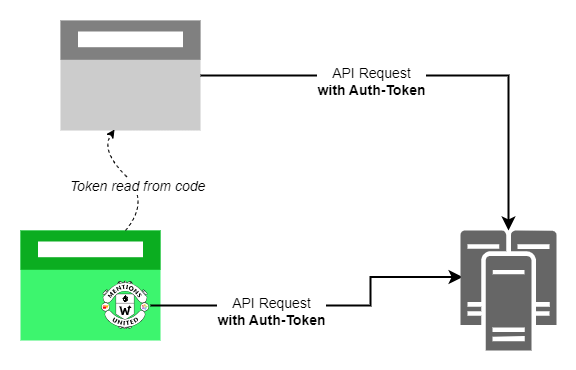
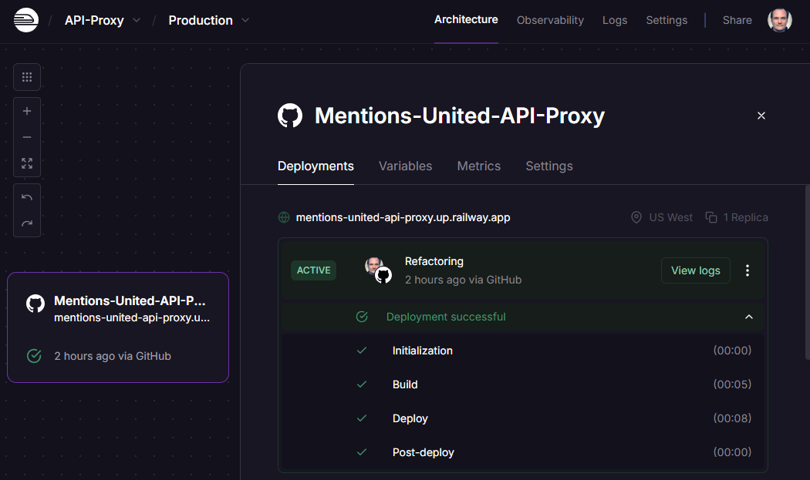

For my project [Mentions United](/projects/mentions-united), which collects interactions from various platforms via API to display them on the own page, at some point I needed a way to hide the authentication tokens required for some APIs from being used by unauthorized parties. You simply don't leave your security keys lying around in the code, especially not if it's publicly visible on GitHub. This may still work somehow for server languages, but JavaScript (and my solution is based on this) is downloaded in the browser and can then be viewed freely. Obfuscators are useless here, as they have become obsolete in the age of AI anyway.

The only way to do this is to build a translator that takes a request without a token and sends one with a token to the remote site and simply passes the result along. A proxy.



<!-- more -->

The aim of the solution was basically to replace the URL of an API call with that of the proxy and to leave the other components of the URL as they are, so that, for example, call 

https://**myproxy.domain**/_**example**_/api/v1/statuses/12345

becomes

https://**example.com**/api/v1/statuses/12345

The basis of my small API proxy is the NPM package [**http-proxy-middleware**](https://www.npmjs.com/package/http-proxy-middleware) from [Steven Chim](https://github.com/chimurai), which I utilized to build a system that can be used via configuration for various endpoints and that runs on a server under the [Node.js](https://nodejs.org) framework [Express](https://expressjs.com).

It was also important to me that not just anyone can use the proxy, but only call sources authorized by me, which was quite easy to achieve using the [CORS middleware]() from Express.

---

## Configuration

The data required for the proxy is stored completely in environment variables. **`PORT`** (under which port number is the server accessible) and **``LOG``** (console output of a proxy process: True/False) are optional and have default values.

**`CORS_URLS`** is a comma-separated list of all authorized sources of a request, such as `https://kiko.io,http://localhost:4000`. 

**`PROVIDERS`** is also a comma-separated list with the names of the supported API endpoints, such as `pixelfed,mastodon,peertube`. 

For each of these providers, two further environment variables are then required for the base URL and the token value and which begins with the provider name. Example:

- **`MASTODON_API_BASEURL`**=`https://indieweb.social`
- **`MASTODON_API_TOKEN`**=`ABC123DEF456`

---

## Code

Here is the content of **`app.js`**, in the order in which it will be called:

Import of the required libraries:

```js
import dotenv from "dotenv";
import express from "express";
import cors from "cors";
import { createProxyMiddleware } from 'http-proxy-middleware';
```

Initializing the [dotenv](https://www.npmjs.com/package/dotenv) library for reading the environment variables and setting defaults:

```js
dotenv.config();

const PORT = process.env.PORT || 3000;
const LOG = process.env.LOG || false;
```

Initializing the Express Server and the CORS middleware:

```js
const app = express();

app.use(cors({
  origin: process.env.CORS_URLS.split(","),
  optionsSuccessStatus: 200
}));
```

Creation of a proxy as a reusable function that does the actual work by rewriting the URL of the incoming request using `pathRewrite` and forwarding it to the `target`:

```js
function getProxy(provider) {
  return createProxyMiddleware({
    target: process.env[provider.toUpperCase() + "_API_BASEURL"],
    changeOrigin: true,
    pathRewrite: (path, req) => {
      if (LOG) { console.log("Proxying " + process.env[provider.toUpperCase() + "_API_BASEURL"] + path); }
      return path.replace("/" + provider, "");
    },

    headers: { Authorization: "Bearer " + process.env[provider.toUpperCase() + "_API_TOKEN"] }
  });
}
```

Iterating over all providers and adding the respective proxy to the routing:

```js
for (const provider of process.env.PROVIDERS.split(",")) {
  app.use("/" + provider, getProxy(provider));
}
```

Starting the fully configured Express Server:

```js
app.listen(PORT, () => {
  console.log(`API Proxy listening on port ${PORT} for ${process.env.PROVIDERS}`);
});
```

This is it. That's all the code you need for the universal API proxy.

---

## Hosting

The app can be hosted wherever Node.JS apps are supported. I opted for [**Railway**](https://railway.com) because it allows you to integrate and control a project completely via GitHub. All you have to do is define a source repository and Railway takes care of the build and deployment itself. This reduces the deployment of the proxy server to checking in code changes on GitHub or changing an environment variable via the Railway interface. However, you can also use [Deploy GitHub Actions to Railway](https://blog.railway.com/p/github-actions).



My current railway plan is the [Hobby Plan](https://railway.com/workspace/plans), which is free up to 5$ consumption of resources in terms of memory, CPU and egress (outgoing traffic). At the moment I barely get to 1$ in a month.

---


url: https://github.com/kristofzerbe/Mentions-United-API-Proxy
title: "GitHub - kristofzerbe/Mentions-United-API-Proxy"
description: "Contribute to kristofzerbe/Mentions-United-API-Proxy development by creating an account on GitHub."
host: github.com
favicon: https://github.githubassets.com/favicons/favicon.svg
image: https://opengraph.githubassets.com/c041e0b3ebf32928209266be74d9cda3abb7c8b3981fc199ebc4ad813a9dd62b/kristofzerbe/Mentions-United-API-Proxy


