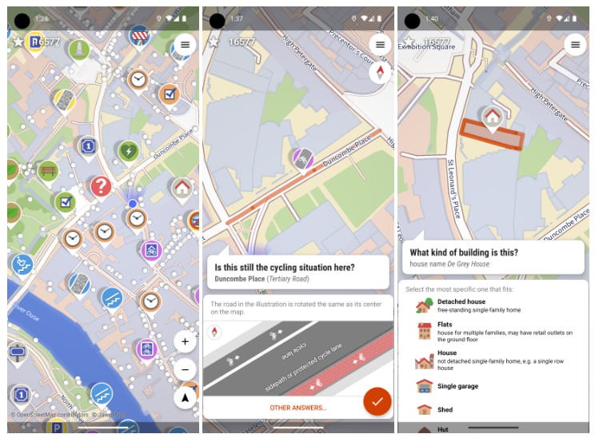

I have been working with [OpenStreetMap](https://www.openstreetmap.org/) for a while now from the developers' perspective, who can use it to conjure up attractive maps, such as my [Photo Map](/photos/map/), on the web free of charge. However, I am not part of the [community](https://community.openstreetmap.org/), nor have I given much thought to where all the data comes from and how it finds its way into the maps. Until recently... when I stumbled across an app review of [**StreetComplete**](https://streetcomplete.app/) by chance and installed the Android app (iOS is planned) out of curiosity.


This app finds missing map data in your vicinity and displays it on a map as quests. Solve each quest by visiting the location on-site and answering a simple question to update the map.


<!-- more -->

A map, i.e., a genuine alternative to the all-powerful Google Maps, thrives not only on topographical features, but also on specific details that offer users added value but are much more time-consuming to capture. That's probably what [Tobias Zwick](https://github.com/westnordost) from Hamburg thought when he wrote the first lines of code for this **OpenStreetMap editor** back in 2017.

The app is not only easy to use, but also has a clever design: it gamifies the recording of map details using a map of the current environment and awards points for answering easy-to-understand questions, which are then entered into a multi-level ranking. There is also a team mode where you can team up with several friends to hunt for points by dividing up tasks.

Instead of silly Pokemon hunting, this wonderful app lets you make open maps accessible to everyone more detailed during a long walk or even in between other activities. I love it and just wish I had discovered it sooner, as I'm currently only ranked 3,255th in Germany.

---


url: https://play.google.com/store/apps/details?id=de.westnordost.streetcomplete&hl=en
title: "StreetComplete - Apps on Google Play"
description: "OpenStreetMap surveyor app"
host: play.google.com
image: https://play-lh.googleusercontent.com/crefZLyOIEES_RgEzHuMscsEDYogHZKFf2EwQ1gKSjL2ngTq42nE5rjalZBroAkSNho

