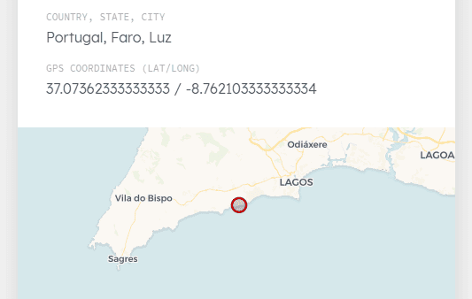
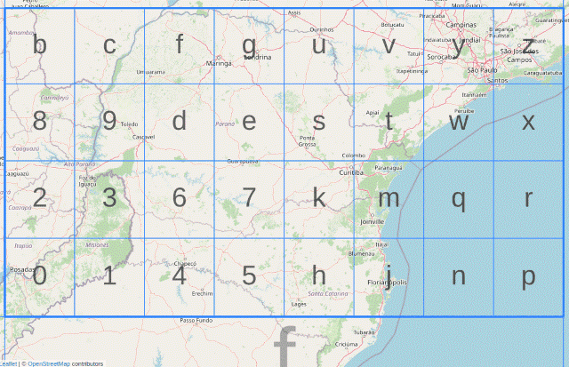

Almost all my photos contain the coordinates of where the shot was taken in the EXIF metadata of the respective file. For this purpose, my Android smartphone has a built-in GPS receiver, and I equipped my Nikon D500 with a [Dawntech di-GPS Eco ProFessional 2](https://www.dawntech.co.uk/shop/index.php?route=product/product&product_id=67) a couple of years ago, although I sometimes forget to switch the thing on and then have to add the location later manually in Lightroom.

Whenever I publish a photo, I always do it first on this website and deliberately include the coordinates (latitude, longitude) of the shot, which are even displayed on a world map on the dedicated photo page:



<!-- more -->

---

Sharing photos – which I usually do from my smartphone – has recently become more difficult for me thanks to Google, because not only is the photo picker introduced into Android a few months ago absolute rubbish, but [Android also actively removes the GPS coordinates](https://shkspr.mobi/blog/2026/04/android-now-stops-you-sharing-your-location-in-photos/) when a photo is uploaded, 'for privacy reasons'! I can understand that, as there are plenty of morons who thoughtlessly reveal their location, but the fact that there are no settings whatsoever to deliberately switch this back on or to choose whether to do so on a per-upload basis is an arrogant way of patronising customers.

I became aware of this issue when, on my favourite photography site [Vernissage](https://vernissage.photos), the coordinates were suddenly no longer pre-filled after uploading from existing EXIF data, as they had been before. At first I thought it was a bug, but after a bit of back and forth with [Marcin](https://github.com/mczachurski) (the developer of the platform) I realized that he couldn't help me and that from now on I have to enter the coordinates manually. It's doable, but manually copying `37.07362333333333 / -8.762103333333334` into two seperate fields is nevertheless a tedious task.

---

## Geohashes

Last week, pinned by [Beto's post](https://robida.net/entries/2026/08/05/using-geohashes-to-share-your-location-on-social-m), I read an article by Frank Edomaruse about so-called [Geohashes](https://en.wikipedia.org/wiki/Geohash), which might help ease my 'problem' somewhat.


url: https://medium.com/@franksagie1/optimizing-location-based-apps-with-geohash-369738597b8c
title: "Geohashing for Developers: Efficiently Encoding and Querying Locations"
description: "Okay, so here's the thing — when you have a location, you usually think of it in terms of latitude and longitude. You know, those two long…"
host: medium.com
favicon: https://miro.medium.com/v2/5d8de952517e8160e40ef9841c781cdc14a5db313057fa3c3de41c6f5b494b19
image: https://miro.medium.com/v2/resize:fit:1024/1*OeNdcDIQU0i0RjSYL1g0iA.png


Some time ago, I did play around a bit with Google's quirky [Plus Codes](https://maps.google.com/pluscodes/), which also summarise coordinates in a short code, but I hadn't yet heard of Gustavo Niemeyer's solution, which he already published back in 2008.

His solution is actually quite simple: the Earth is mathematically transformed into a flat rectangle and divided into squares, each of which is assigned a number or a letter. This process is repeated over and over again in each square, up to the highest level, 9. Frank explains the maths behind it very well in his article.



The coordinates `37.07362333333333 / -8.762103333333334` are mathematically transformed into the code `ey9fbt59s`.

The original website '*geohashes.org*' is no longer available, but there's **[geohash.es](https://www.geohash.es/)** by [Alberto Rico](https://www.alrico.es/), where you can play around with coordinates and Geohashes.

---

## node-geohash

Of course, there are libraries available that convert GPS coordinates to geohashes. It's just maths, after all. As my website is based on Hexo and therefore Node.JS, I've extended my [photo generator](https://github.com/kristofzerbe/kiko.io/blob/master/lib/photo-generator.cjs) – which reads the EXIF data from new photos while importing and saves it to JSON files – using [Ning Sun](https://github.com/sunng87)'s script **[node-geohash](https://github.com/sunng87/node-geohash)**:

```js
const geohash = require('ngeohash');

...

if (meta.latitude && meta.longitude) {
  meta.custom.geohash = geohash.encode(meta.latitude, meta.longitude);
}
```

That's all ... and I now display this custom metadata on all photo pages with a link to Alberto's geohash.es.


url: https://kiko.io/photos/25-05-Portugal-0957-D50/
title: "Photo Blue Pathway Sign - kiko.io"
description: "Photo Blue Pathway Sign by Kristof Zerbe"
host: kiko.io
favicon: https://kiko.io/favicon.ico
image: https://kiko.io/photos/mobile/25-05-Portugal-0957-D50.jpg


---

The only thing left to do now is to convince Marcin to [introduce Geohash support to Vernissage](https://github.com/VernissageApp/VernissageWeb/issues/569) ;)
