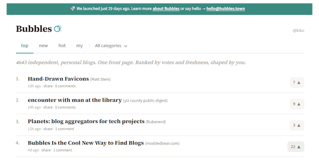

Any new way of interconnecting websites and users on the [IndieWeb](https://indieweb.org/) is not only welcome but also vital for a stable counterbalance to Big Tech's shitty walled gardens. Yesterday I stumbled across a really good and new one, that integrates also the Fediverse: **[Bubbles](https://bubbles.town/)** from [Ben](https://troet.cafe/@viermalbe).

> We monitor thousands of independent, personal blogs via RSS. Every new post appears on Bubbles automatically. Nobody submits individual links.The blogs were hand-picked from various curated sources and individually reviewed.

There are currently around [5,000 blogs](https://bubbles.town/blogs.txt) and I was surprised to find my own among them.

<!-- more -->

You can use Bubbles to jump into all new posts of these blogs freely, but if you log in to Bubbles using your own Fediverse account (Mastodon, Pixelfed or whatever federated platform you like), you are also able to vote or comment on posts or follow an entire blog.

This enables Bubbles to generate three views:

- NEW - new posts
- HOT - posts ranked by votes and freshness
- TOP - post people are commenting currently

The commenting thing is particularly interesting because it uses automatically syndicated posts on GoToSocial under [@bubbles@social.bubbles.town](https://social.bubbles.town/@bubbles). Comments therefore do not end up in some dubious databases, but in the structures intended for this purpose by the ActivityPub protocol.

Anyone familiar with my website may know that I follow exactly the same approach for posts and photo comments, except that I manually set the syndication on Mastodon, Pixelfed or Vernissage. When loading a certain page, I use my [Mentions United](https://kiko.io/projects/mentions-united/) script to collect all comments on that post from the various platforms via its syndications and display them below the post.

Here, Bubbles syndicates automatically for me, and all I need now is to implement a GoToSocial plugin for Mentions United to show these syndications and the corresponding comments under the post too. Awesome ... stay tuned.

More than that ... Ben is providing a tiny script called ``vote.js`` to embed the given votes from Bubbles on a posts page. See [Embed the Bubbles vote count](https://bubbles.town/embed)

For more info about Bubbles, I recommend to read the detailed [FAQ](https://bubbles.town/faq) to learn more of this amazing project.
