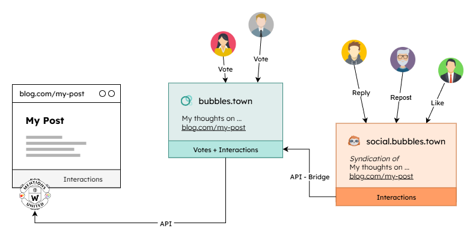

As I wrote recently, [I Love Bubbles](/post/I-Love-Bubbles). The new blog post aggregator (based on the RSS feeds of a curated list of blogs) has become part of my morning routine: making coffee, browsing my blogroll, opening [**Bubbles**](https://bubbles.town), and discovering new posts from blogs I've never heard of before — though that's about to change ;)

Since my blog is also included in Bubbles' list — and I imagine others are in the same boat — I suspect the reach of my posts will increase somewhat. Previously, I could only achieve this by manually syndicating my posts, primarily on Mastodon and IndieNews, and my photos on Vernissage and Pixelfed.

Now Bubbles helps me on that, by automatically syndicating its entry to its own GoToSocial instance in the Fediverse. And of course, I'm interested in bringing the interactions with my post, that accumulate there, back to my site, just as I already do with the other platforms through my [**Mentions United**](/projects/mentions-united/) project. That's why there's now a new [Bubbles plugin](/projects/mentions-united/) ...

<!-- more -->

---

Bubbles not only lets users vote on posts to determine the rankings in the TOP and HOT sections, but also allows them to comment via the mentioned GoToSocial instance. Both types of interaction can be accessed via a single API without an access token, which Ben has kindly made available to us. The structure of the new plugin looks like this:



For those unfamiliar with how Mentions United works, here's a brief overview: The JavaScript-based client system consists of a main script to which two different types of plugins can be registered:

1. **Provider** Plugins, for collecting interactions from a specific platform
2. **Renderer** Plugins, for displaying the interactions converted to a uniform format in a specific location within the page's HTML

The Bubbles plugin is therefore a new Provider plugin that collects not only the votes, but also all other interactions in a total of 4 separate requests. Key value to all this is the syndication URL of the entry on Bubbles, like [https://bubbles.town/entry/114467](https://bubbles.town/entry/114467).


For more information, I recommend my initial article [**Mentions United ... 3, 2, 1, Go**](/post/Mentions-United-3-2-1-go/) on the project and what it is all about.


To integrate the plugin into your website, you just need a little experience with JavaScript ... and some predefined empty HTML elements in your posts page, where the generated code will be placed by Mentions United.

1. Include the main script, the Provider plugin and the desired Renderer plugins (here two of those I use for my posts):

```js
<script src="/js/mentions-united.js"></script>
<script src="/js/mentions-united-provider_bubbles.js"></script>
<script src="/js/mentions-united-renderer_avatars-by-type.js"></script>
<script src="/js/mentions-united-renderer_grouplist-by-origin.js"></script>
```

2. Initialize the main script with the required options and the list of plugins:

```js
// wait until the page is loaded ...
window.addEventListener('load', function () {

  // init Mentions United with your name, to distinguish your interactions from others', 
  // and an array of new instances of the plugins with their options
  const mentionsUnited = new MentionsUnited({ 
    ownerName: "__MY-NAME__" 
  },[
    new MentionsUnitedProvider_Bubbles({ 
      syndicationUrl: "__BUBBLES-ENTRY-URL__"
    }),
    new MentionsUnitedRenderer_AvatarsByType({
      placeholderId: "__LIKES-PLACEHOLDER-ID__",
      typeVerb: "like"
    }),
    new MentionsUnitedRenderer_AvatarsByType({
      placeholderId: "__REPOSTS-PLACEHOLDER-ID__",
      typeVerb: "repost"
    }),
    new MentionsUnitedRenderer_GroupListByOrigin({
      placeholderId: "__GROUPLIST-PLACEHOLDER-ID__",
      skipTypes: "like, repost"
    })
  ]);

}
```

<small>(Please replace the ``__VARIABLES__`` in the sample with your data.)</small>

3. Let it run

```js
mentionsUnited.load()
  .then(() => {
    return mentionsUnited.show();
  })
  .then((count) => {
    // do something, if needed
  });
```

All you have to do now is spruce up the raw HTML inserted by the scripts with a little CSS so it fits your design.

---

As I write this, it occurs to me that passing the Bubbles entry URL in the new provider plugin isn't actually necessary, because Ben has kindly written an API endpoint that can resolve it, based on the blog post URL. I'm sure I can integrate this into the next version soon.
