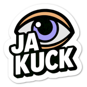
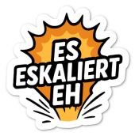
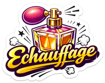
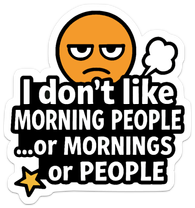

I'm 57 and currently hooked on stickers, and [AI](/ai) isn't entirely innocent in this, combined with a bit of a guilty conscience - but it's a lot of fun.

I recently "retired" my old business laptop after just two short years, with a battery life of 28 minutes after a full charge, and somehow I felt sorry, because the best thing about that otherwise junk of a Dell laptop was the lid with the stickers (see header image). Everything started with the "truck" in the middle, which ended up on my desk one day and seemed to be yelling, "Stick me on your laptop!"

<!-- more -->


**A Brief Detour**
This chubby, red guy with wheels instead of feet, known as [Brummi](https://www.brummi.de/brummi-geschichte), is a marketing mascot from 1971 that the German transport industry created to give road freight transport a new image. Every German of my generation knows him, and to this day he remains a symbolic figure for a wide variety of projects in the industry, where I've been working as an IT manager for a few years now.


Next came a few stickers from my favorite soccer club, SV Wehen-Wiesbaden, a few from fundraising campaigns, and some I still had lying around somewhere.

One day, I had the idea to turn one of my wife's sayings into a sticker, because it's so typical of the region she comes from (Sauerland, east of Dortmund) and it's already become a running joke between us...

You can't really translate this into English, because literally it would mean "Yeah, look" or "See," but that doesn't capture the essence of the saying at all. Imagine your wife or someone else telling you how to do something, but you do it differently at first, until you come around and have to admit that it works. Then you get the ironic version of "Ja kuck" But it's always meant positively - to briefly comment on an action that produces something positive or interesting.

Now, I'm not artistically gifted, so I threw a quick prompt at ChatGPT, and it surprised me with a nice graphic, which I immediately uploaded to StickerApp to have nearly 80 4x4 cm stickers made. A few days later, it ended up on my laptop (and now also on various public signs and poles across Europe ;)

---

The next sticker that found its way onto the lid comes from a funny conversation about coworkers and other enemies, and translates to "It's escalating anyway". No matter what you do, trouble is bound to happen.

---

One evening, my wife came home from work and told me that she and her colleagues had been coming up with new perfume names all day long after one of them used the laminator and a strong plastic smell lingered in the air for a moment - something like "Lamination, a fragrance by Ralf Laurel". My favorite creation was "Echauffage" (pronounced in French), the perfume you put on when you're really pissed off 😂 Of course, with ChatGPT's help, I had to put that on my laptop. In the meantime, the sticker has spread among my coworkers, and recently I was having trouble hiding my anger about something and was asked if I was wearing THAT perfume.

---

There are two types of people: Larks, who cheerfully jump out of bed early in the morning and go to bed early at night, and Owls, who you're better off not talking to before 9 a.m. but who are fit and alert well into the night. I'm an Owl, and so that everyone knows right away, I had to turn this postcard saying into a sticker.

---

Germans love to make fun of their own language, which allows them to form wonderfully long words like "Donaudampfschiffartskapitänsmütze." People who have only a limited grasp of English add to the fun by trying to translate such a German word one-to-one into English.

The biggest hit I've come across lately is "onewallfree," the direct and hilariously incorrect translation of the German "einwandfrei," meaning "flawless." I just HAD to get that as a sticker...

---

I've since switched to the Swedish sticker printer PrettyGoodStickers, because they can produce even very small batches of 5 to 10 stickers for a low price and ship them to you. It's perfect for all the silly ideas in my head - though I'll eventually run out of space on my laptop lid.
