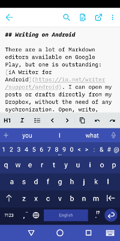

I work with several devices, some Windows, some Android, and sometimes I have time to write on my articles at home (Notebook, Tablet), in my spare time in the office (Desktop, Laptop) or on my way to somewhere (Smartphone). Right now I'm am in a barber shop, waiting for my haircut and write these lines. So, wherever I am, I need the Hexo project locally, but in sync on a digital device.

The blog is synced via Dropbox, but hosted on GitHub Pages, so on every device I need the  publishing functions of Git too.

<!-- more -->

## Sync Hexo Project

Best option for me to achieve this was  [Dropbox](https://dropbox.com). Another benefit on that is: I can work on the structure of the blog wherever I am and commit when the new feature or improvement is done, because all Git related files are always in sync too.

## Writing, Editing and Publishing on Windows

My preferred editor is [Visual Studio Code](https://code.visualstudio.com/). Good file handling, easy writing, full Git integration and tons of other plugins and helpers. Chapeau Microsoft, well done.

Some of the following VS Code plugins makes working with Hexo on GitHub pages a breeze:

---

[]((https://marketplace.visualstudio.com/items?itemName=codeyu.vscode-hexo){.lefty})  
Adds Hexo commands like ``init``, ``new``, ``generate``, ``server`` and ``clean`` to the VS Code command palette.

---

[](https://marketplace.visualstudio.com/items?itemName=yzhang.markdown-all-in-one)  
Keyboard shortcuts for basic formatting, automatic list editing, autocomlete for images,  table formatter and much more for an easier handling of Markdown.

---

[](https://marketplace.visualstudio.com/items?itemName=DavidAnson.vscode-markdownlint)  
Markdown linting and style checking

---

[](https://marketplace.visualstudio.com/items?itemName=sysoev.language-stylus)  
Adds syntax highlighting and code completion to Stylus files

---

[](https://marketplace.visualstudio.com/items?itemName=sysoev.language-stylus)  
Complete visual management of your repositories in VS Code

---

[](https://marketplace.visualstudio.com/items?itemName=mhutchie.git-graph)  
View a Git Graph of your repository with all changes and manage commits.

---

With this editor and its helpers, I'm just two clicks away from publishing a new article or even a new version of the Hexo blog itself.

## Writing on Android

There are a lot of Markdown editors available on Google Play, but one is outstanding: [iA Writer for Android](https://ia.net/writer/support/android). I can open my posts or drafts directly from Dropbox, without the need of any sychronization. Open, write, close, done.



## Publishing on Android

There are some Git related Android apps out there, but no solution was satisfying. Furthermore, I didn't really need Git here, because I didn't want to have all source files on my smartphone. I'm working directly on the Dropbox stored MD files via iA Writer. Finally and most important, Git won't be enough, because before publishing, I have to run ``hexo generate``! Therefore some sort of automatic transfer from Dropbox to GitHub is also out of the game.

What I needed, was to tell a server at a certain point of time 'Hey, please publish for me', using the only connection I have: Dropbox.

### Introducing a Demon

I have a little media server, running on Windows, and he is synchronizing some folders with Dropbox. He could do the job! After I installed all necessary packages, like NodeJS, Hexo and Git, I included the project folder into the sync. 

Next step was to design a so called **Hexo Command File**, a simple TXT file, which holds commands in single lines, extended with execution times, when they were successfully running.

```properties
postdraft: A-New-Blog-Blogging-and-Synching-en-route
publish
newdraft: "A New Blog: Blogging and Synching en route" @ 2019-09-30 21:15
regenerate @ 2019-09-29 16:40:01
publish @ 2019-09-29 16:40:10
```

These commands are predefined, because they bundle several real commands and I didn't want to deal with real commands, due to security reasons.

The unprocessed commands are standing at the top of the file (in execution order!) and parameters are separated from the command by a colon and delimited by commas.

    <command>: [<param1>, ...] @ <execution time>

Next step was to create a program to work as an executing demon, who monitors the Hexo Command File (synced by Dropbox) on my server and executes commands without execution dates.

I decided to create a simple Console Application in C# and use the built-in [Windows Task Scheduler](https://en.wikipedia.org/wiki/Windows_Task_Scheduler) for running it every 2 minutes. The application is called **HexoCommander** and is [available at GitHub](https://github.com/kristofzerbe/HexoCommander).

It expects the Hexo Command File to be named ``hexo-commands.txt``, located in the same folder, and provides the following commands:

**newdraft: "&lt;title&gt;"** ... runs

1. ``hexo new draft "<title>"``

Creates a new draft.

**postdraft: "&lt;filename without extension&gt;"** ... runs

1. ``hexo publish "<filename without extension>"``

Makes a post out of a draft.

**regenerate** ... runs

1. ``hexo clean``
2. ``hexo generate``

Wipes all Hexo static pages and generates them new.

**publish** ... runs

1. ``hexo generate``
2. ``git add "source/*" "docs/*"``
3. ``git commit -m "Remote publication via HexoCommander"``
4. ``git push origin master``

Generates Hexo static pages, stage changes on drafts, posts and static pages, commits the changes with a generic message and pushes them to the server.

### Running the demon

I would have never expected, that the trickiest part was to get HexoCommander running via Windows Task Scheduler. What a mess! I finally find the solution [here](https://social.msdn.microsoft.com/Forums/SqlServer/en-US/29446adf-8304-4b9f-bbc4-95daf2941d53/program-runs-fine-but-task-scheduler-wont-run-it?forum=winserver2008appcompatabilityandcertification):

1. Compile HexoCommander in a **x86** configuration

2. Create a new task in Task Scheduler with
   * **Trigger**
     * Dialy
     * Recur every 1 days
     * Repeat task every 2 minutes for a duration of 1 day
   * **Action**
     * Program/Script: **%systemroot%\Syswow64\cmd.exe**
     * Add Arguments: **/C "C:\MyPath\HexoCommander.exe /workdir=C:\MyPath"**
     * Start In: **%systemroot%\Syswow64\\**

Because some executing commands in the chain are NOT 64-bit, I had to force Task Scheduler to run the 32-bit Command Shell in its own path (see 'Start In' and don't forget the closing backslash) and take the 32-bit compiled HexoCommander as argument after the parameter ```/C``` (forcing command to terminate), including its own argument for defining the real working directory. Mind bending, but works...

---

## Related

* [A New Blog (Part One): VS Code, Hexo and GitHub Pages](/categories/Tools/A-New-Blog-VS-Code-Hexo-and-GitHub-Pages/)
* [A New Blog (Part Two): Customizing Hexo](/categories/Tools/A-New-Blog-Customizing-Hexo/)