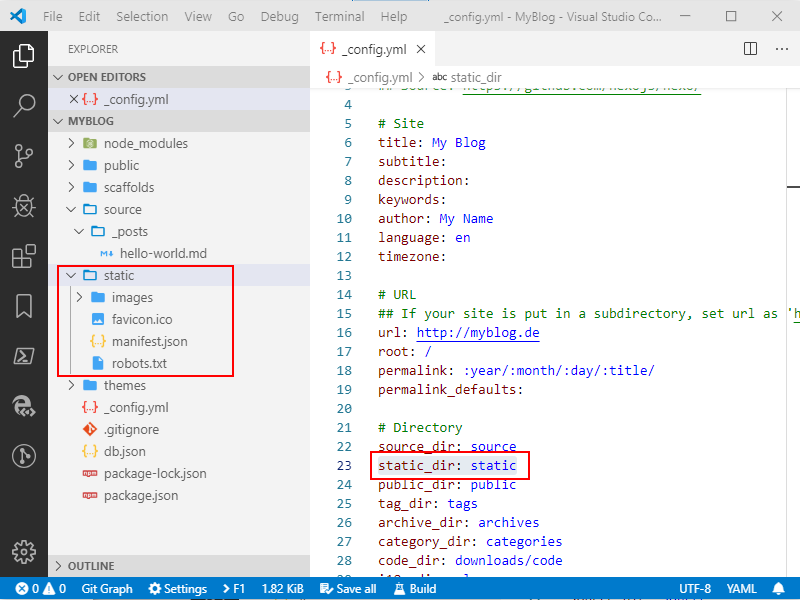

Hexo is a great tool to get quick results, when you decide to have a blog and its defaults are practical, but it's power lies in the possiblities of customization via plugins. On the [official plugin page](https://hexo.io/plugins/index.html), there are actually 302 plugins listed, but there are many more and no wish will be unsatisfied.

I will show you which of these I found worth to work with...
<!-- more -->

### Relative Image Path

The build-in way to include images in your posts works fine, but it is a little aside the normal way to declare images in Markdown. The plugin [Hexo Asset Link] corrects that. After installing via ``npm install hexo-asset-link --save`` you can write this:

    

**UPDATE**: Actually the plugin [destroys external links](https://github.com/liolok/hexo-asset-link/issues/3), so don't use it until this is fixed ... or go to **node_modules** &gt; **hexo-asset-link** &gt; **index.js** in your project and change in line 22 ``protocal`` to ``protocol``.

### Hide Posts

A new Hexo project comes with a sample post called ``Hello World``. This is fine to play around with, but you don't want to publish it. Here comes a Hexo plugin to the rescue called [Hexo Hide Posts](https://github.com/printempw/hexo-hide-posts). After installing, you just have to write ``hidden: true`` to the Front Matter of you post and it won't be shown on the blog, but it is still available by URL.

### Static Files

Hexo has the concept of [Assets Folders](https://hexo.io/docs/asset-folders), but for static files, beside article based files, I find it more useful to have a STATIC folder and copy the contents on every build into the publish folder. A good helper for this approach is the plugin [Hexo Generator Copy](https://github.com/niahoo/hexo-generator-copy). Install it by running ``npm install hexo-generator-copy --save`` and add ``static_dir: static`` to your ``_config.yml`` and you are done.

### Feed

The default Hexo layout has an Atom Feed icon in the upper right corner, but strangely no feed file is generated on build. You need to install the plugin [Hexo Feed Generator](https://github.com/hexojs/hexo-generator-feed) to fix this, by running ``npm install hexo-generator-feed --save`` and copy following section into the ``_config.yml``:

    feed:
        type: atom
        path: atom.xml
        limit: 20
        hub:
        content:
        content_limit: 140
        content_limit_delim: ' '
        order_by: -date

### Manifest for PWA

In these modern times it's always a good idea, that your blog feels like an App. For this you need a manifest file (JSON) an several icons (PNG). You can generate these files very fast with the [Web App Manifest Generator](https://app-manifest.firebaseapp.com) and store it in your static folder.

To bind this file into your blog, you can use the plugin [Hexo PWA](https://github.com/lavas-project/hexo-pwa). Run ``npm install --save hexo-pwa`` and copy following section to your ``_config.yml``, where you take the settings from your generated manifest file:

    pwa:
    manifest:
        path: /manifest.json
        body:
        name: myblog.de
        short_name: My Blog
        icons:
            - src: /images/icon-192x192.png
            sizes: 192x192
            type: image/png
            - src: /images/icon-512x512.png
            sizes: 512x512
            type: image/png
        start_url: /index.html
        theme_color: '#025ab1'
        background_color: '#dddddd'
        display: standalone

### Sitemap File

To help [Google](https://support.google.com/webmasters/answer/183668) and others a bit to index your blog, it is advisable to provide a sitemap file. Here comes [Hexo Generator Sitemap](https://github.com/hexojs/hexo-generator-sitemap) to the rescue. Install it by running the command ``npm install hexo-generator-sitemap --save``. You can configure it via ``_config.yml``:

    sitemap:
        path: sitemap.xml
        template: ./sitemap-template.xml

The plugin installation doesn't create the needed ``sitemap-template`` file, so be sure you grab a copy from the plugins repository: [https://github.com/hexojs/hexo-generator-sitemap/blob/master/sitemap.xml](https://github.com/hexojs/hexo-generator-sitemap/blob/master/sitemap.xml)

### Commenting

Hexo doesn't have a commenting system, but it's prepared to stick [Disqus](https://disqus.com/) comments under each article. Just create a new Disqus account for your blog and note the given short name. By adding following section to the ``_config.yml`` Hexo shows the commenting section:

    disqus_enabled: true
    disqus_shortname: my-blog

### Inifinite Scroll

Hexo shows as much articles at the start page as configured in ``_config.yml`` under ``index_generator.per_page``, but it's nicer to load more articles as you scroll by using the Hexo script [Inifinite Scroll](https://github.com/FrontendSophie/hexo-infinite-scroll). Install by adding following little script in **themes** & gt; **layout** &gt; **_partial** &gt; **after-footer.ejs**

     
    

### Back To Top

Its nice to support the reader on scolling by providing a Scroll-To-Top button. The easiest way to get this, is the script [Vanilla Back To Top](https://github.com/vfeskov/vanilla-back-to-top). Just add follwing to **themes** &gt;**layout** &gt; **_partial** &gt; **after-footer.ejs**:

    
    

---

## Related

* [A New Blog (Part One): VS Code, Hexo and GitHub Pages](/categories/Tools/A-New-Blog-VS-Code-Hexo-and-GitHub-Pages/)
