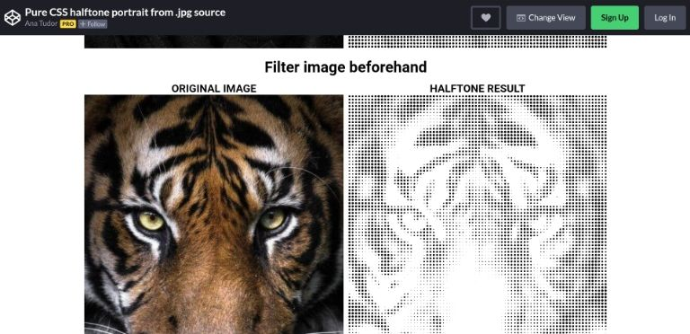
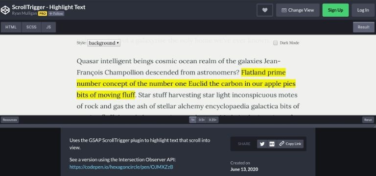
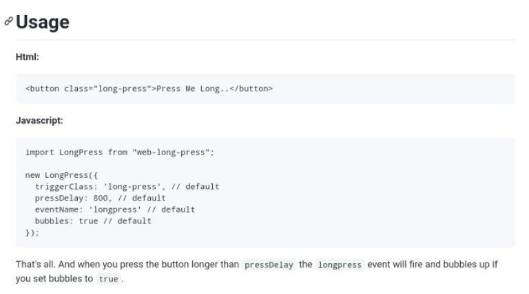
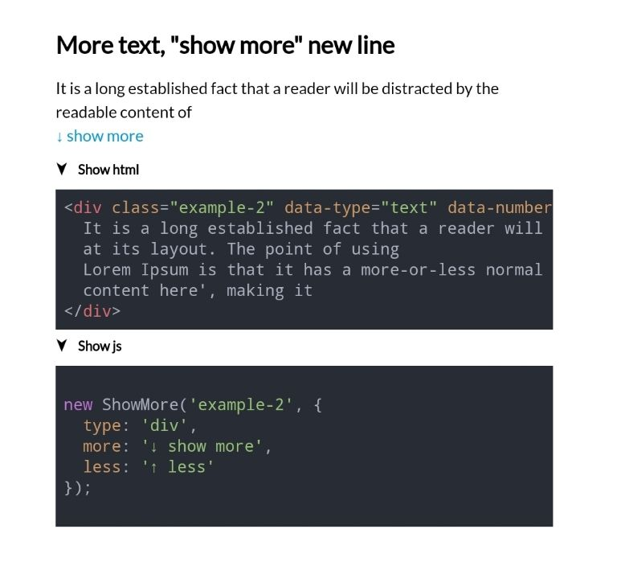
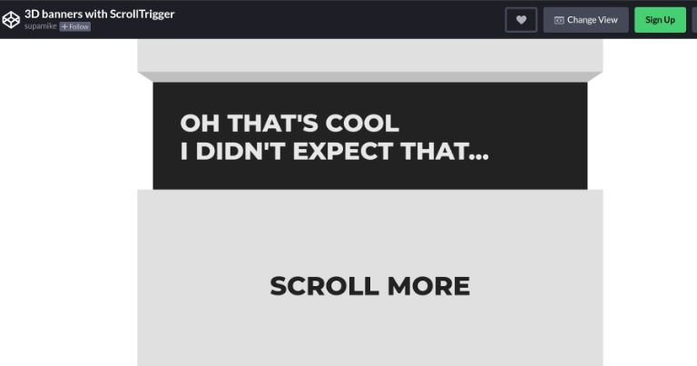
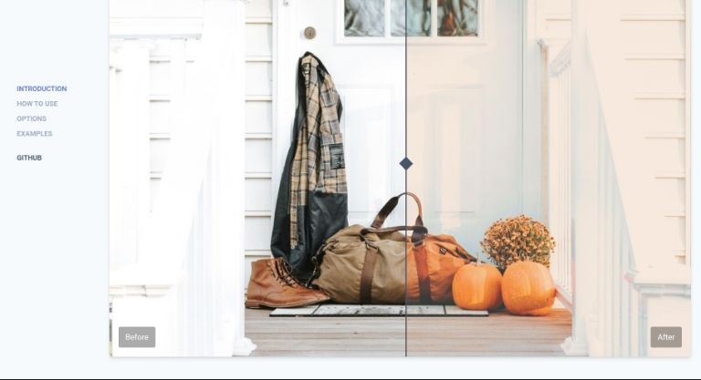
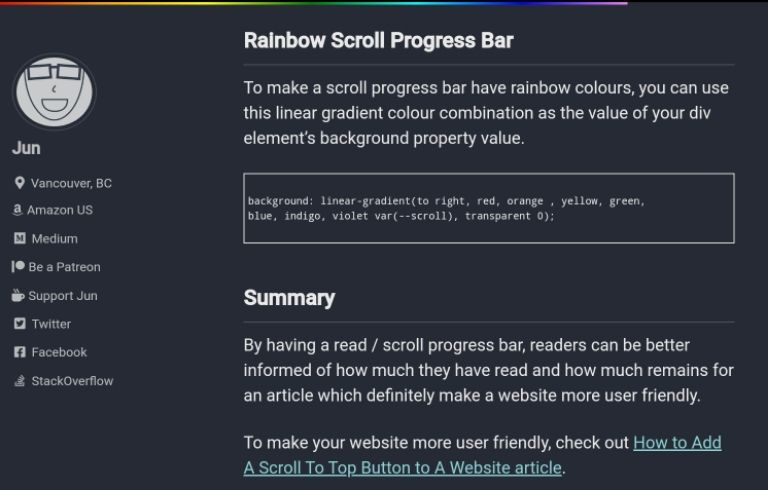
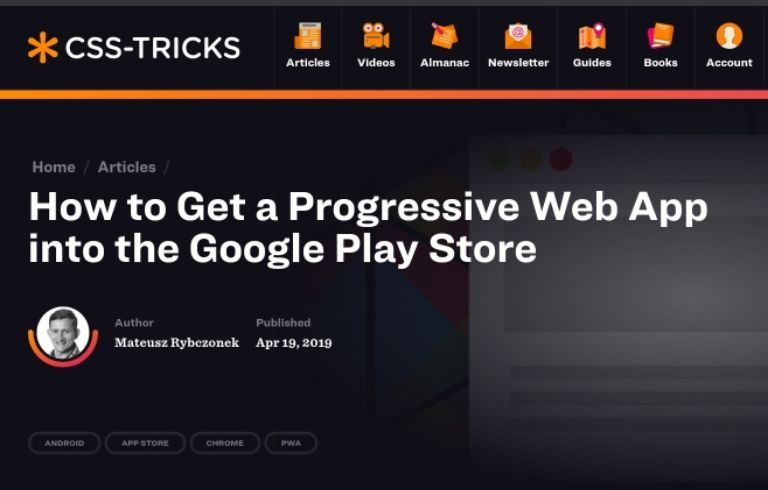

Due to my daily routine, I'm reading a lot of articles on the web regarding software development. 

The most interesting stuff ends up on my Pocket list, which grows from day to day. Hard to find the pearls, when I need them. This recurring posts will throw a stroke of light on them.

They are maybe not the newest finds, not the fanciest ones, but remarkable for me and maybe for you also.

* Pure CSS halftone portrait from .jpg source
* ScrollTrigger - Highlight Text
* Tiny long-press event handler
* Show More/Less
* 3D banners with ScrollTrigger
* Image Compare Viewer
* Add Read or Scroll Progress Bar To A Website To Indicate Read Progress
* How to Get a Progressive Web App into the Google Play Store

<!-- more -->

--- 

## Pure CSS halftone portrait from .jpg source
by Ana Tudor : [https://codepen.io/thebabydino/pen/LYGGwrm](https://codepen.io/thebabydino/pen/LYGGwrm)

Ana, author at [CSS Tricks](https://css-tricks.com/author/thebabydino/), shows a CSS-only technique to convert an image into a halftone one.

---

## ScrollTrigger - Highlight Text
by Ryan Mulligan : [https://codepen.io/hexagoncircle/details/gOPMwvd](https://codepen.io/hexagoncircle/details/gOPMwvd)

We all highlight important text passages for our readers. Ryan does the in an unusual, butt cool way by using GSAP ScrollTrigger.

--- 

## Tiny long-press event handler
by MudOnTire : [https://github.com/MudOnTire/web-long-press](https://github.com/MudOnTire/web-long-press)

Vanilla JS multi-instance handling of long press event the easy way.

---

## Show More/Less
by Grzegorz Tomicki : (https://github.com/tomik23/show-more)[https://github.com/tomik23/show-more]

Grzegorz's little JS helper to cut texts, lists and even tables and show a MORE link.

---

## 3D banners with ScrollTrigger
by supamike : [https://codepen.io/supamike/full/KKVqXmR](https://codepen.io/supamike/full/KKVqXmR)

Awesome 3D effect on scrolling made with [ScrollTrigger](https://greensock.com/scrolltrigger/).

---

## Image Compare Viewer
by Kyle Wetton : [https://image-compare-viewer.netlify.app/](https://image-compare-viewer.netlify.app/)

Comparison slider in Vanilla JS to compare BEFORE and AFTER images, which works responsively on every device.

---

## Add Read or Scroll Progress Bar To A Website To Indicate Read Progress
by Jun711 : [https://jun711.github.io/web/add-scroll-progress-bar-to-a-website-to-indicate-read-progress/](https://jun711.github.io/web/add-scroll-progress-bar-to-a-website-to-indicate-read-progress/)

A classic, simply explained...

Here another approach: [CSS Tricks: Reading Position Indicator](https://css-tricks.com/reading-position-indicator/)

---

## How to Get a Progressive Web App into the Google Play Store
by Mateusz Rybczonek : [https://css-tricks.com/how-to-get-a-progressive-web-app-into-the-google-play-store/](https://css-tricks.com/how-to-get-a-progressive-web-app-into-the-google-play-store/)

Mateusz describes very detailed how offer your PWA as an App via Google Play Store.
