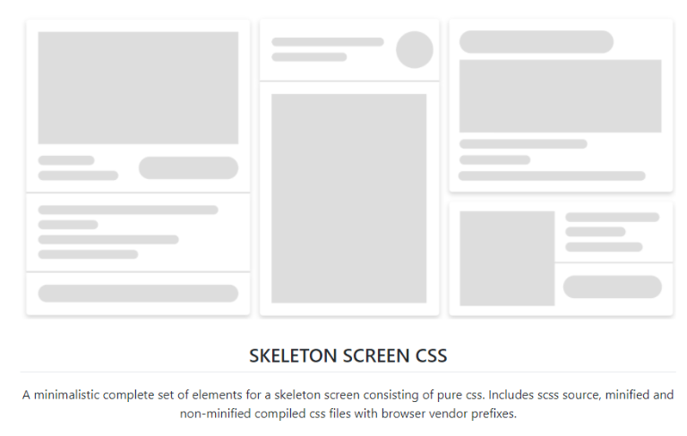

New month, new discoveries. We will deal with key bindings, downloads on the fly, a lot of animations and contrasting images. Have fun, trying out these stunning solutions.

* tinykeys - Modern library for keybindings
* Creating files in JavaScript in your browser
* CSS Animated Google Fonts
* Skeleton Screen CSS
* More Control Over CSS Borders With background-image
* A CSS-only, animated, wrapping underline
* Nailing the Perfect Contrast Between Light Text and a Background Image
* Contrast.js

<!-- more -->

---

## tinykeys - Modern library for keybindings
by Jamie kyle : [https://jamiebuilds.github.io/tinykeys/](https://jamiebuilds.github.io/tinykeys/)

Very easy to use key binding library for JavaScript. Supports key sequences and modifier keys.

---

## Creating files in JavaScript in your browser
by Kilian Valkhof : [https://kilianvalkhof.com/2020/javascript/creating-files-in-javascript-in-your-browser/](https://kilianvalkhof.com/2020/javascript/creating-files-in-javascript-in-your-browser/)

Kilian shows how to prepare data in JavaScript and offer them to download on the fly, without the use of storing a file.

---

## CSS Animated Google Fonts
by Jhey Tompkins : [https://dev.to/jh3y/animated-google-fonts-193d](https://dev.to/jh3y/animated-google-fonts-193d)

As Google Fonts now supports variable fonts, Jhey shows a solution how to create neat font animations with them.

---

## Skeleton Screen CSS
by Dmitriy Kuznetsov : [https://github.com/nullilac/skeleton-screen-css](https://github.com/nullilac/skeleton-screen-css)

When loading data on demand, it is sometimes advisable to show placeholders, where the data will be filled in. Dimitriy has founded a CSS framework for these skeletons.

---

## More Control Over CSS Borders With background-image
by Chris Coyier : [https://css-tricks.com/more-control-over-css-borders-with-background-image/](https://css-tricks.com/more-control-over-css-borders-with-background-image/)

Borders are used to seperate things in a layout, but the build-in possibilities of CSS are restricted. Chris found a way by pimping borders up, using background images.

---

## A CSS-only, animated, wrapping underline
by Nicky Meuleman : [https://nickymeuleman.netlify.app/blog/css-animated-wrapping-underline](https://nickymeuleman.netlify.app/blog/css-animated-wrapping-underline)

As Chris did for the borders, Nick's doing on underlined links. An end to boring rigid unterlines, let's animate them.

---

## Nailing the Perfect Contrast Between Light Text and a Background Image
by Yaphi Berhanu : [https://css-tricks.com/nailing-the-perfect-contrast-between-light-text-and-a-background-image/](https://css-tricks.com/nailing-the-perfect-contrast-between-light-text-and-a-background-image/)

Showing text on background images can be challenging due to contrast and readability. Yaphi has developed a solution to find always the right transparent overlay to show the most of the picture, but keep the text readable. Stunning...

---

## Contrast.js
by Misha Petrov : [https://github.com/MishaPetrov/Contrast.js](https://github.com/MishaPetrov/Contrast.js)

Misha addresses the same problem as Yaphi, showing text on background images, but goes a different way with his library, which is trying to find the best constrasting text color, even if the page is responsive.