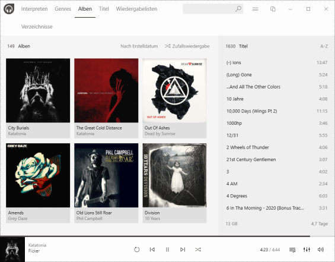

Not very often, when I'm looking for a new tool to replace some annoying or outdated piece of software, I have to blog about it ... but from time to time, I'm discovering pearls, worth to lose a word about.

The Windows 10 built-in media player Groove is (to be kind) ... nice, but it is more or less a leftover from Microsoft's attempt to create a competitor to iTunes, years ago. The crippeled UI is not the most modern and I was more than once annoyed about its usability.

Doing a research for a good alternative, you stumble always over the usual suspects: MediaMonkey, Foobar2000, Winamp, VLC or even Media Player Classic!? Not modern enough, not user friendly enough, not lean enough.

I really don't remember where, but there was a screenshot of a player, which seems to be the complete opposite of the others: **Dopamine** from [Digimezzo](https://www.digimezzo.com/software/), a project by the Belgian developer [Raphaël Godart](https://twitter.com/RaphaelGodart)...

<!-- more -->

But that wasn't the best, especially for me. **Dopamine** is written in C# as a WPF application and it is OpenSource, [hosted on GitHub](https://github.com/digimezzo/dopamine-windows).

The software is so wonderful lean and its integrating in Windows 10 like a charm. It has several categories to find the right music to play, a context-sensitive search, a folder view, is able to import and manage playlists, a light and dark mode and translations into currently 28 languages. It can update your collection automatically from several folders, has two player modes and is incredibly fast.

The keep long story short ... I fell in love on **Dopamine**'s simple beauty and it is now my favourite player on Windows 10! 

Thanks Raphaël...
