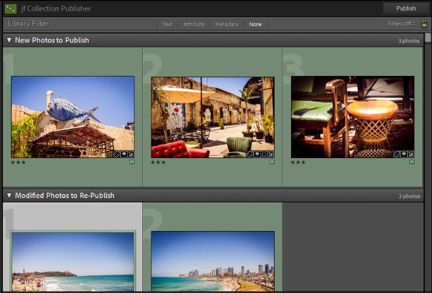
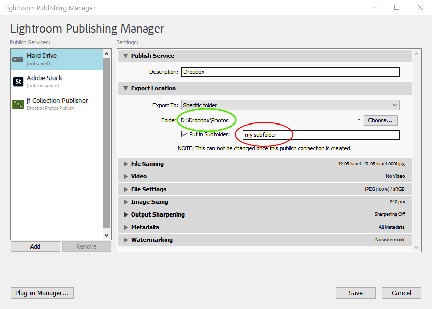
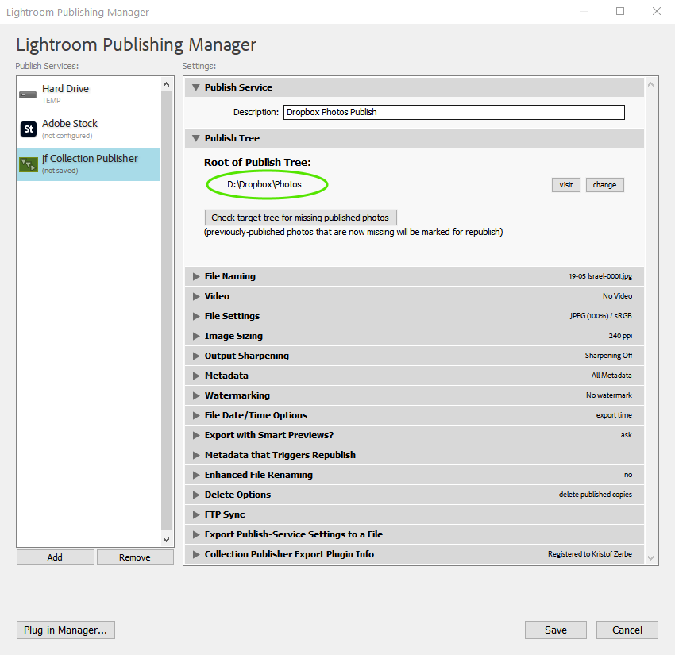
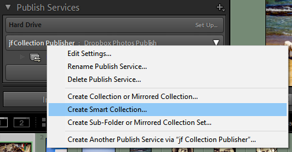
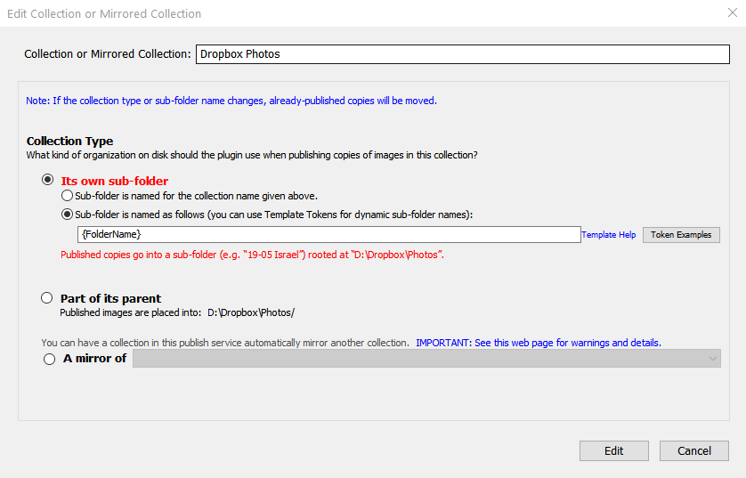

In all times photography was a process: First you shoot you images, then you process them and in the third step you publish them elsewhere.

Today **Adobe Lightroom** is a de-facto standard in photo processing, especially when you shoot RAW images. And I mean [Lightroom Classic](https://www.adobe.com/de/products/photoshop-lightroom-classic.html) and not the new web/smartphone based software, which doesn't come even close to the desktop application yet.

I use Lightroom for all purposes after I shot my images: editing, cataloguing, managing and ... publishing. On püpublishing Lightroom offers you two approaches: *Export* and *Publish*. While *Export* is mainly for creating JPG copies of edited RAW images, *Publish* goes one step further and gives you the ability to do "something" with your exported JPG's, for example upload them on Flickr, Instagram, 500px or to your own web server via FTP. Major difference to *Export* is, that *Publish* keeps your images in sync. Everytime you change the source images, the defined publish services recognizes and offer you to re-publish your image.



In the past years I tried a lot of Lightroom plugins for publishing on several platforms, but it doesn't work out for long, because all these platforms change their API almost every year (or are stamped) and the sparely maintained 3rd party plugins break.

My workflow for quite some time is to publish my photos on the hard drive, in a folder, which is synced via Dropbox with the cloud. From there I distribute them further.

<!-- more -->

Important on this approach is, to have a coherent output folder structure in order find a particular image afterwards. I store my RAW images on an external hard drive in a structure like this:

```txt
<Drive:\>
  ->  Fotos
      ->  <Year>
          ->  <Year>-<Month> <Eventname>
```

First step after shooting, is to copy all RAW files from the SD Card into a new subfolder of the current year. From there I import them into my Lightroom catalog.

After sorting, rejecting, editing and flagging in Lightroom, I have to "export" the 4- and 5-star rated images into the cloud. There I have a slightly different structure, with a different root folder name and without the year:

```txt
<Dropbox>
  ->  Photos
      ->  <Year>-<Month> <Eventname>
```

With the built-in "Hard Drive" publish service of Lightroom, it is feasible to "export" the images, but not in my wanted folder structure, because it is not possible to use the sources' folder name as output folder name by option. It has to be specified manually each time, which is not very comfortable.



## Plugin to the rescue

Jeffrey Friedl, who is in the Lightroom plugin business about a decade, offers two plugins, which can solve the problem easily:

1. [Jeffrey’s "**Folder Publisher**" Lightroom Plugin](http://regex.info/blog/lightroom-goodies/folder-publisher)  
  Exports to disk in a folder hierarchy that mimics the folder hierarchy in your Lightroom catalog

This one helps me not much, because my output folder would look like this:

```txt
<Dropbox>
  ->  Photos
      ->  Fotos
          -> <Year>
              ->  <Year>-<Month> <Eventname>
```

2. [Jeffrey’s "**Collection Publisher**” Lightroom Plugin](http://regex.info/blog/lightroom-goodies/collection-publisher)  
Exports to local disk in a folder hierarchy that mimics the collection hierarchy you build within Lightroom

Besides the commonality of defining a root folder, where the files are exported to, Jeffrey's plugin has much more options to improve the export.



As the main feature, you can create collections within the plugin to define the export targets:



In the options of these collections, you can set several templates (variables) to let the plugin name the export subfolder automatically:  



By using [Smart Collections](https://helpx.adobe.com/lightroom-classic/help/photo-collections.html#work_with_smart_collections) you don't even need to drag & drop your images to publish to the publish collection. Lightroom will do this auto-magically.
