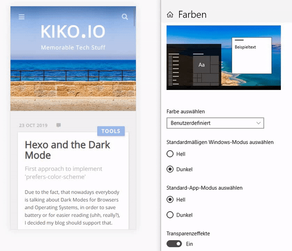

Due to the fact, that nowadays everybody is talking about Dark Modes for Browsers and Operating Systems, in order to save battery or for easier reading (uhh, really?), I decided my blog should support that.


<!-- more -->

Starting point is the new media query ``prefers-color-scheme``, which is actually supported by all modern browsers.

### Technique

My first read was Tom Brow's [Dark mode in a website with CSS](https://tombrow.com/dark-mode-website-css), where he shows how to use the media query. Simplified, this is it, assuming the light version is the default:

```css
body {
    background-color: white;
    color: black;
}

@media (prefers-color-scheme: dark) {
  body {
    background-color: black;
    color: white;
  }
}
```

### Pimping CSS for automatic switching

To support the automatic browser/OS-based automatic switch in Hexo, where [Stylus](http://stylus-lang.com/) is used, I had to change some template files. First the ``_variables.styl``:

```styl
// existing color variables
color-background = #f1f1f1
color-foreground = #111
color-border = #ddd
...

// new dark color variables
dark-color-background = #111
dark-color-foreground = #eee
dark-color-border = #000
...

// new media query variable
prefers-dark = "(prefers-color-scheme: dark)"
```

Next step was to change the ``_extend.styl``, where some Stylus variables are defining complete blocks to extend. Here I had to supplement all lines, where something mode-dependend was defined, by adding the new ``prefers-dark`` media query and beneath the new 'dark' equivalence of the style:

```styl
$base-style
  hr
    ...
    border: 1px dashed color-border-article
    @media prefers-dark
      border: 1px dashed dark-color-border-article
    ...

$block
  ...
  background: color-block
  box-shadow: 1px 2px 3px color-border
  border: 1px solid color-border
  @media prefers-dark
    background: dark-color-block
    box-shadow: 1px 2px 3px dark-color-border
    border-color: dark-color-border

...
```

The same changes I had to do in every template ``styl`` file, where one of the colors or other mode dependent style was used. For example:

```styl
#mobile-nav-header
  background-color: color-background
  @media prefers-dark
    background-color: dark-color-background
  img.avatar
    ...
    @media prefers-dark
      filter: brightness(85%)
```

This will be rendered as:

```css
  #mobile-nav-header {
    background-color: #f1f1f1;
  }
  @media (prefers-color-scheme: dark) {
      #mobile-nav-header {
      background-color: #111;
    }
  }

  #mobile-nav-header img.avatar {
    ...
  }
  @media (prefers-color-scheme: dark) {
    filter: brightness(85%);
  }
```

Please note the use of ``filter:brightness()`` in the example. It is always advisable to darken the images too, because they can really pop out on dark backgrounds.
