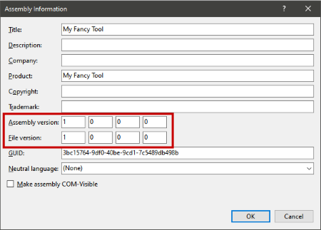
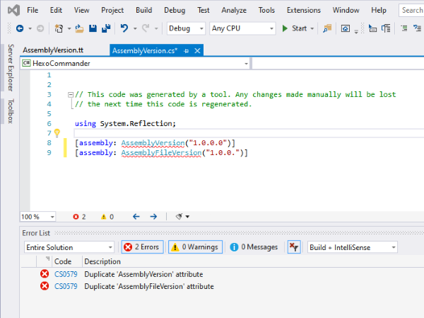
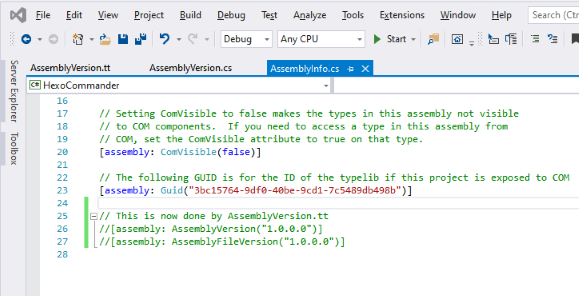
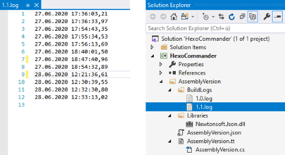
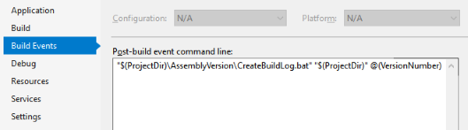
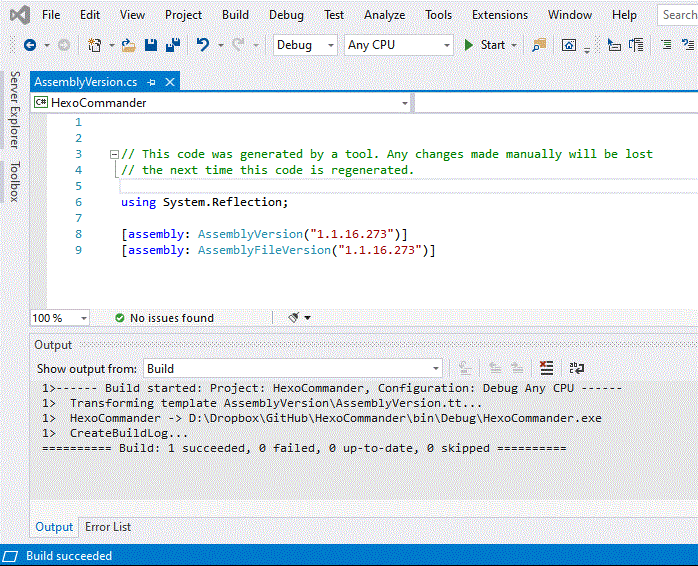

Every developer has to have an idea of versioning his products. If you work with Visual Studio you have the ``Assembly Information`` in the project properties dialog, to enter it manually everytime you want to release a new version:



The four fields are: MAJOR, MINOR, BUILD, REVISION.

But seriously ... who does that? I guess 99% of all C# developers are entering the ``AssemblyInfo.cs`` and enter the famous 2 asterisks into the version declaration of BUILD and REVISION, to let Visual Studio do the incrementation job:

```c#
[assembly: AssemblyVersion("1.0.*.*")]
[assembly: AssemblyFileVersion("1.0.*.*")]
```

But this is not the end of the possibilities ... Let's do it more meaningful, with some goodies and still automatic...
<!-- more -->

### More informative versioning

A build with an increased MAJOR version number means, that there are significant changes in the product, even breaking changes. This always should be set manually.

Also the MINOR. It stands for significant functional extensions of the product.

How does Visual Studio calculate BUILD and REVISION?


When specifying a version, you have to at least specify major. If you specify major and minor, you can specify an asterisk for build. This will cause **build** to be equal to the **number of days since January 1, 2000 local time**, and for **revision** to be equal to the **number of seconds since midnight local time, divided by 2**.


But, the BUILD number should explain, how often a software with a particular MAJOR.MINOR has been build, due to minor changes and bug fixes.

The "Asterisk" REVISION number is a little weird, but at least with the BUILD number unique. But it says nothing. Better to pick up the idea of a date calculated, unique number, but not an arbitrary date ... let's take the date the project has started.

For example: **1.2.16.158** ... reads version 1.2 with 16 builds on the 158'th day after the project has started.

### Start with T4

T4 (Text Template Transformation Toolkit) is a templating system in Visual Studio for generating text files during design time. It is very suitable to even generate code. Read about it [here](https://docs.microsoft.com/en-us/visualstudio/modeling/code-generation-and-t4-text-templates) and [here](https://docs.microsoft.com/en-us/visualstudio/modeling/writing-a-t4-text-template).

A Text Template (.tt) has **Directives** (how the template is processed), **Text blocks** (text copied to the output) and **Control blocks** (program code).

For our versioning template, we start with this in a new file named **``AssemblyVersion.tt``**:

*Directives*:

```xml
<#@ template hostspecific="true" language="C#" #>
<#@ output extension=".cs" #>
```

*Control block*:

```c#
<#
  int major = 1;
  int minor = 0;
  int build = 0;
  int revision = 0;
#>
```

*Text block*:

```c#
// This code was generated by a tool. Any changes made manually will be lost
// the next time this code is regenerated.

using System.Reflection;

[assembly: AssemblyVersion("<#= $"{major}.{minor}.{build}.{revision}" #>")]
[assembly: AssemblyFileVersion("<#= $"{major}.{minor}.{build}.{revision}" #>")]
```

On saving the TT file, a new CS file with the same name will be created automatically and you got an error like this:



#### A new place for version info

Th error occurs, because we have now **two** ``AssemblyVersion`` and ``AssemblyFileVersion`` attributes in our project. We need to comment out the original in ``Properties\AssemblyInfo.cs``:



#### Structural Considerations

It makes sense to store all needed files for the new versioning system in a new root folder of the project, named **AssemblyVersion**, starting with the ``AssemblyVersion.tt``, because there will be more files later on.

### New app information file

As we replaced the original version attributes in the project with those from our generated  ``AssemblyVersion.cs``, we cannot control the MAJOR and MINOR version number via the project property dialog any longer. We need a new approach on that, which can be edited easily and processed automatically.

#### AssemblyVersion.json

```js
{
  "initialDate": "2019-09-29",
  "versions": [
    {
      "major": 1,
      "minor": 1,
      "releaseDate": "",
      "remarks": "Some cool new features; New versioning system"
    },
    {
      "major": 1,
      "minor": 0,
      "releaseDate": "2019-10-01",
      "remarks": "Initial Release"
    }
  ]
}
```

This new JSON file has two main items:
* ``initialDate`` - the date the project has started, to calculate the REVISION later on
* ``versions`` - a list with all different MAJOR/MINOR versions we have done so far, with at least one without a release date ... the one with the highest ``major`` and ``minor``.

The ``remarks`` attribute of a list item holds some information about the changes in a new version. Together with ``releaseDate``, useful for a possible release history, shown in the product itself.

#### Library references in T4

T4 runs in its own app domain, therefore it can use built-in libraries as ``System.IO``, but not third-party libraries like ``Newtonsoft.JSON``. 

We could reference those libraries from the projects package folder via the absolute path (if we use it in our product), but when we are running a NuGet update, the reference will break. 

It is advisable to store such libraries directly in a fixed folder, like **AssemblyVersion\Libraries**. They won't have any impact to our product, because the are only used while design time.

### The MAJOR and MINOR

To process the new ``AssemblyVersion.json`` in the template, we need some new directives for referencing the needed libraries and the import of the appropriate namepaces:

```xml
<#@ assembly name="System.Core" #>
<#@ assembly name="$(SolutionDir)\AssemblyVersion\Libraries\Newtonsoft.Json.dll" #>

<#@ import namespace="System.IO" #>
<#@ import namespace="System.Linq" #>
<#@ import namespace="Newtonsoft.Json" #>
```

Via the use of the T4 variable ``$(SolutionDir)``, we can point to our copy of Newtonsoft JSON.

Now we can read and convert the JSON into an anonymous object and get the highest values of MAJOR and MINOR:

```c#
<#
    string avPath = this.Host.ResolvePath("AssemblyVersion.json");
    string avJson = File.ReadAllText(avPath);

    var avDefinition = new {
        initialDate = "",
        versions = new [] {
            new {
                major = 0,
                minor = 0,
                releaseDate = "",
                remarks = "" }
        }
    };
    var avObject = JsonConvert.DeserializeAnonymousType(avJson, avDefinition);

    //Get highest Major/Minor from versions list
    var maxVersion = avObject.versions
      .OrderByDescending(i => i.major)
      .ThenByDescending(j => j.minor)
      .First();

    //Set MAJOR
    int major = maxVersion.major;

    //Set MINOR
    int minor = maxVersion.minor;
#>
```

### The BuildLog

In order to get the version number for BUILD, we need a method to count and store every build that has been run, separated by the MAJOR/MINOR versions. This is a job for a **Post-build event**, which can be configured in the project properties dialog. The event uses shell commands as they are used on the command line.

What the commands should do:&nbsp;&nbsp;&nbsp;Write a new line with the current date and time in a log file, named after the MAJOR/MINOR version and stored in the folder **AssemblyVersion\BuildLogs**.



#### Extending build event macros

Shell commands for build events are supporting built-in variables, so called 'macros', like ``$(ProjectDir)`` (which returns the project directory path), but there is no such macro for the current version number. We have to introduce it via extending the project with a new build target.

Unload the project in Visual Studio for editing the CSPROJ (or VBPROJ) file of your product manually and write the following definition just before the end-tag:

```xml
  <PropertyGroup>
    <PostBuildEventDependsOn>
      $(PostBuildEventDependsOn);
      PostBuildMacros;
    </PostBuildEventDependsOn>
  </PropertyGroup>

  <Target Name="PostBuildMacros">
    <GetAssemblyIdentity AssemblyFiles="$(TargetPath)">
      <Output TaskParameter="Assemblies" ItemName="Targets" />
    </GetAssemblyIdentity>
    <ItemGroup>
      <VersionNumber Include="@(Targets->'%(Version)')" />
    </ItemGroup>
  </Target>
```

After reloading the project in Visual Studio, we can use ``@(VersionNumber)`` in our commands.

#### CreateBuildLog.bat

The event build editor is not very comfortable, so we create the batch file ``CreateBuildLog.bat`` in our **AssemblyVersion** folder and use this as the post build event command.


The BuildLog folder must exist, before running the following command the first time!


```bat
@echo off

REM --Get parameters
set PROJECT_DIR=%1
set VERSION_NUMBER=%2

REM --Set what to log
set LOG_LINE=%DATE% %TIME%

REM --Inform the user
set MSG=CreateBuildLog '%LOG_LINE%' for version %VERSION_NUMBER%
echo %MSG%

REM --Get version parts
FOR /f "tokens=1,2,3,4 delims=." %%a IN ("%VERSION_NUMBER%") do (
	set MAJOR=%%a
	set MINOR=%%b
	set BUILD=%%c
	set REVISION=%%d
)

REM --Define BuildLog file and folder 
set BUILDLOG_FILE=%MAJOR%.%MINOR%.log
set BUILDLOG_FOLDER=%PROJECT_DIR%\AssemblyVersion\BuildLogs

REM --Write current date and time as new line in the file
echo %LOG_LINE% >> %BUILDLOG_FOLDER%\%BUILDLOG_FILE%"
```



```bat
"$(ProjectDir)\AssemblyVersion\CreateBuildLog.bat" "$(ProjectDir)" @(VersionNumber)
```

### The BUILD

As we have now the BuildLogs, we can use them in the template:

```c#
<#
    ...

    //Get BuildLog of max version
    string buildlogFolder = this.Host.ResolvePath("BuildLogs");
    string buildLog = 
      buildlogFolder + "\\" +
      maxVersion.major + "." +
      maxVersion.minor + ".log";

    //Get number of lines from BuildLog or create a new log (!)
    var buildCount = 1;
    if (File.Exists(buildLog)) {
        buildCount = File.ReadLines(buildLog).Count() + 1;
    } else {
        File.Create(buildLog).Dispose();
    }

    //Set BUILD
    int build = buildCount;
#>
```

Very important is to create the log file, if it doesn't exists! Otherwise the build will always fail, because the version attributes can't be created.

### The REVISION

At least we have to set the REVISION number, by calculating the difference between the current date and the ``initialDate``, which we have previously read from the ``AssemblyVersion.json``:

```c#
<#
    ...

    //Set REVISION
    var dateCreated = DateTime.Parse(avObject.initialDate);
    int revision = (DateTime.Now.Date - dateCreated.Date).Days;
#>
```

### Transforming T4 template on build

The last hurdle is to run the text transformation every time you build your product. Until now it runs only on saving the ``AssemblyVersion.tt``.

A great helper on that was Thomas Levesque's post ["Transform T4 templates as part of the build, and pass variables from the project"](https://thomaslevesque.com/2017/11/13/transform-t4-templates-as-part-of-the-build-and-pass-variables-from-the-project/), where he describes every difficulty to reach this goal.

To make it short: We have to edit the CSPROJ file again, to introduce TextTemplating to MSBuild.

First we need following near the beginning of the projects XML:

```xml
<PropertyGroup>
    <VisualStudioVersion Condition="'$(VisualStudioVersion)' == ''">
      16.0
    </VisualStudioVersion>
    <VSToolsPath Condition="'$(VSToolsPath)' == ''">
      $(MSBuildExtensionsPath32)\Microsoft\VisualStudio\v$(VisualStudioVersion)
    </VSToolsPath>
    <TransformOnBuild>true</TransformOnBuild>
    <OverwriteReadOnlyOutputFiles>true</OverwriteReadOnlyOutputFiles>
    <TransformOutOfDateOnly>false</TransformOutOfDateOnly>
</PropertyGroup>
```

Secondly add the IMPORT of the TextTemplating target AFTER the CSharp target:

```xml
<Import Project="$(MSBuildToolsPath)\Microsoft.CSharp.targets" />
...
<Import Project="$(VSToolsPath)\TextTemplating\Microsoft.TextTemplating.targets" />
```

If you build your product now, a new build log is created and the version numbers BUILD and REVISION are automatically increased.

### See it in action

The project where I implemented this versioning first is [HexoCommander](https://github.com/kristofzerbe/HexoCommander). Feel free to download the code and see how the new versioning mechanism works.



Enjoy versioning...